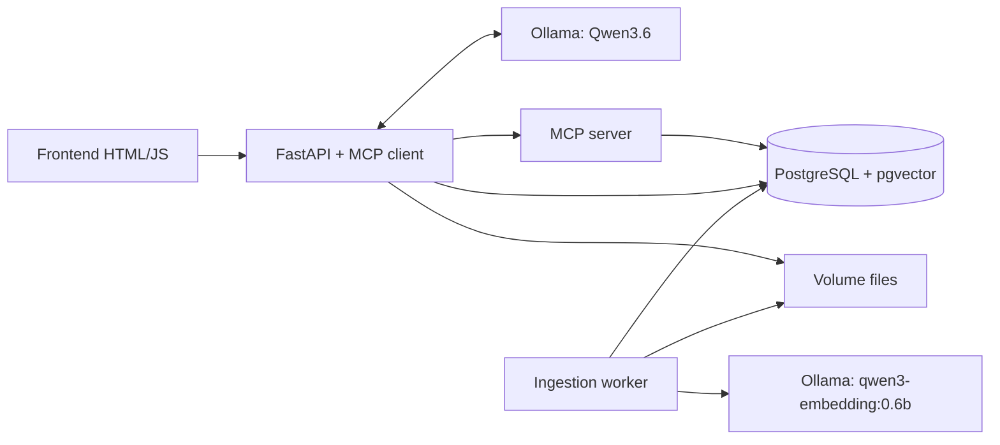

# Kiến trúc app RAG PostgreSQL

## Mục tiêu và hiện trạng

Demo local bằng Docker: chat tiếng Việt, upload Word, tìm kiếm hybrid, trả lời có nguồn và so sánh phiên bản chính sách. Yêu cầu gốc: [Readme.md](Readme.md). Tiến độ thực tế: [TASKS.md](TASKS.md).

Máy đích: Windows, Docker Desktop Linux/WSL2, RAM 32 GB, RTX 5060 Ti 16 GB. Không giả định Qwen3.6 vừa hoàn toàn trong VRAM. Bước đầu kiểm tra GPU trong container; sau đó benchmark model trước khi chốt tag/quantization. Context khởi điểm 4096, một request sinh câu trả lời tại một thời điểm.

## Các thành phần

- `app`: REST API, frontend, điều phối hội thoại và MCP client.
- `mcp-server`: Python MCP SDK, Streamable HTTP nội bộ, tools chỉ đọc dữ liệu.
- `postgres`: metadata, pages/chunks, vectors, full-text search, hàng đợi ingest.
- `ollama`: GPU inference, volume model riêng; chỉ nạp một model đồng thời để giảm VRAM.
- `worker` (task ingest): lấy job từ PostgreSQL, chuyển Word sang PDF bằng LibreOffice, parse PDF theo trang, embed tuần tự. Chưa cần Redis/Celery cho demo.

Chỉ app bind localhost:8000. Database, MCP và Ollama ở mạng Compose nội bộ. Đây là demo local một người dùng; authentication/multi-tenant chưa thuộc MVP.

## Model và giới hạn tài nguyên

- `CHAT_MODEL=qwen3.6:27b` là ứng viên benchmark, chưa được xác nhận phù hợp máy đích. Model mặc định được niêm yết khoảng 18 GB, có thể phải offload RAM. Cho phép đổi tag qua `.env` sau benchmark; không tự đổi sang họ model khác.
- `EMBED_MODEL=qwen3-embedding:0.6b`, dùng cùng model/cấu hình cho query và document. Kiểm tra dimension thực tế trước khi tạo cột/index vector ở task ingest.
- `OLLAMA_NUM_PARALLEL=1`, `OLLAMA_MAX_LOADED_MODELS=1`; context chat 4096. Đo độ trễ khi đổi giữa embedding/chat model.
- Không đặt memory limit WSL tự động; theo dõi RAM thực tế, chừa tài nguyên cho Windows. Không xem dung lượng model là tổng yêu cầu VRAM.
- Ghi lại tag, digest, context, thời gian phản hồi, `ollama ps`, GPU/RAM sau benchmark. Pin image/model đã kiểm chứng trước khi đóng gói demo.

## Luồng upload và version

1. Upload tài liệu mới hoặc chọn `document_id` để thêm version.
2. Giới hạn kích thước/đuôi file; lưu theo ID nội bộ, không dùng đường dẫn người dùng cung cấp.
3. Cấp version trong transaction có khóa tài liệu: `v0.1`, `v0.2`, … `v0.10`. Hai số nguyên, không dùng float. Unique constraint theo tài liệu và version.
4. Lưu file gốc bất biến, checksum, thời gian upload UTC và job `queued`.
5. Worker chuyển `.doc`/`.docx` sang PDF trong thư mục riêng cho mỗi job. PDF là chuẩn pagination; Word có thể thay đổi layout theo font/render engine. Demo dùng page break và font có sẵn trong container.
6. Parse từng trang, chunk không vượt qua ranh giới trang. Trang dài chia theo giới hạn token; giữ nguyên `page_number` và thứ tự chunk.
7. Embed và lưu dữ liệu; chỉ công bố version `ready` khi tất cả bước thành công. Retry idempotent, không nhân bản chunks; job lỗi có thông báo và retry hữu hạn.

Mặc định search bản `ready` mới nhất của từng document. Bản mới lỗi không thay thế bản cũ. Upload date khác effective date; thiếu effective date thì không tự kết luận chính sách đang có hiệu lực.

## Schema dự kiến

| Bảng | Trường chính |
|---|---|
| documents | id, title, category, created_at |
| document_versions | id, document_id, major, minor, original_name, storage_path, checksum, uploaded_at, effective_at, status, error |
| pages | id, version_id, page_number, text |
| chunks | id, page_id, chunk_index, text, embedding, embedding_model, search_vector |
| ingestion_jobs | id, version_id, status, attempts, lease_until, error |
| conversations/messages | lịch sử, role, content, citations |

Task nền tảng chỉ tạo `schema_migrations` và extension `vector`; các bảng nghiệp vụ được thêm bằng migration ở task tiếp theo. Migration đánh số, checksum, transaction và advisory lock; không phụ thuộc init script chỉ chạy một lần trên volume mới.

## Retrieval và MCP

Tools dự kiến:

- `list_document_versions(document_id)`.
- `search_documents(query, mode, document_ids, version_ids, top_k)`.
- `get_document_pages(version_id, page_numbers)`.

Task nền tảng cung cấp `system_status` để kiểm tra handshake và database thực sự qua MCP. Các tool truy xuất được thêm khi có schema và ingestion.

Vector cosine search và PostgreSQL FTS (`simple`, chuẩn hóa dấu cho tiếng Việt) chạy với cùng bộ lọc version **trước** khi lấy top-k. Hybrid gộp bằng RRF với hằng số khởi điểm 60, deduplicate theo chunk ID. Giữ text gốc để trích dẫn. Với vài chục trang dùng exact vector search; chỉ thêm HNSW khi có dữ liệu/đo đạc chứng minh cần.

FastAPI lấy tool schemas từ MCP, gửi vào Ollama chat; nhận tool calls, validate tên/arguments, gọi MCP rồi trả kết quả về model. Giới hạn vòng gọi (khởi điểm 6), timeout và kích thước context. Nội dung tài liệu được coi là dữ liệu, không phải chỉ thị thực thi. Model không được gọi SQL tùy ý.

Trả lời đính kèm chunk IDs đã truy xuất; backend xác minh nguồn và dựng citation `file/version/page`. Không đủ bằng chứng thì báo thiếu dữ liệu. UI hiển thị trạng thái gọi tool và nguồn, không yêu cầu xuất chuỗi suy luận nội bộ.

So sánh hai version: lấy bằng chứng riêng từng bản; đối chiếu theo mã chính sách/chủ đề, không giả định số trang giống nhau. Khi yêu cầu toàn bộ thay đổi, đọc toàn bộ hai bản demo thay vì chỉ top-k rồi tuyên bố đầy đủ.

## API và frontend dự kiến

- `GET /health/live`, `GET /health/ready`: có trong nền tảng.
- `POST /documents`, `POST /documents/{id}/versions`.
- `GET /documents`, `GET /documents/{id}/versions`, `GET /jobs/{id}`.
- `POST /search`: mode vector/keyword/hybrid và bộ lọc version.
- `POST /chat`: stream sự kiện trạng thái/token/citation bằng SSE qua fetch.
- Frontend: chat, upload/trạng thái, danh sách version, chọn chế độ search, nguồn và bảng so sánh.

## Demo và tiêu chí nghiệm thu

Sinh 4 file `.docx`: `hr_policy_v0.1`, `hr_policy_v0.2`, `bonus_policy_v0.1`, `bonus_policy_v0.2`. Mỗi file đúng 10 trang sau render, mỗi trang một câu. Dữ liệu chính sách giả lập, có mã chính sách và một số thay đổi có chủ đích.

Kiểm tra: 40 trang được ingest; câu trả lời đúng nguồn/version; câu hỏi ngoài dữ liệu; so sánh bản cũ/mới; keyword chính xác và paraphrase; không trộn version; upload đồng thời không trùng version; retry không nhân bản; restart giữ dữ liệu. Bộ câu hỏi có expected page/version để đo retrieval trước khi đánh giá LLM.

## Nguồn kỹ thuật

- [Docker Compose GPU](https://docs.docker.com/compose/how-tos/gpu-support/)
- [MCP Python SDK](https://github.com/modelcontextprotocol/python-sdk)
- [Ollama tool calling](https://docs.ollama.com/capabilities/tool-calling)
- [Qwen3.6](https://ollama.com/library/qwen3.6)
- [Qwen3 Embedding](https://ollama.com/library/qwen3-embedding)
- [pgvector hybrid search](https://github.com/pgvector/pgvector#hybrid-search)
