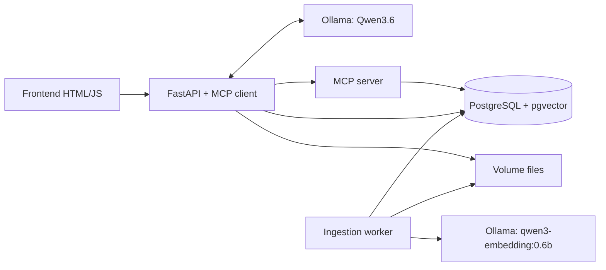

# Kiến trúc app RAG PostgreSQL

## Mục tiêu và hiện trạng

Demo local bằng Docker: chat tiếng Việt, upload Word, tìm kiếm hybrid, trả lời có nguồn và so sánh phiên bản chính sách. Yêu cầu gốc: [Readme.md](Readme.md). Tiến độ thực tế: [TASKS.md](TASKS.md).

Máy đích: Windows, Docker Desktop Linux/WSL2, RAM 32 GB, RTX 5060 Ti 16 GB. Không giả định Qwen3.6 vừa hoàn toàn trong VRAM. Bước đầu kiểm tra GPU trong container; sau đó benchmark model trước khi chốt tag/quantization. Context khởi điểm 4096, một request sinh câu trả lời tại một thời điểm.

## Các thành phần

- `app`: REST API, frontend, điều phối hội thoại và MCP client.
- `mcp-server`: Python MCP SDK, Streamable HTTP nội bộ, tools chỉ đọc dữ liệu.
- `postgres`: metadata, pages/chunks, vectors, full-text search, hàng đợi ingest.
- `ollama`: GPU inference, volume model riêng; chỉ nạp một model đồng thời để giảm VRAM.
- `worker`: lấy job từ PostgreSQL, chuyển Word sang PDF bằng LibreOffice, parse PDF theo trang, embed tuần tự. Chưa cần Redis/Celery cho demo. `CHUNK_STRATEGY=header` giữ section path từ Markdown headings trong `chunks.section_path`; mặc định `page` để tương thích tài liệu hiện tại.

Chỉ app bind localhost:8000. Database, MCP và Ollama ở mạng Compose nội bộ. Đây là demo local một người dùng; authentication/multi-tenant chưa thuộc MVP.

## Model và giới hạn tài nguyên

- `CHAT_MODEL=qwen3:4b` đang được kiểm thử trên máy đích. Có thể phải offload RAM; không tự đổi sang họ model khác. `CHAT_THINK=false` mặc định để giảm độ trễ demo; có thể bật qua `.env`, nhưng phải đánh giá lại token/context và thời gian phản hồi.
- `EMBED_MODEL=qwen3-embedding:0.6b`, dùng cùng model/cấu hình cho query và document. Schema dùng vector(1024); worker kiểm tra dimension, giá trị hữu hạn và vector khác zero cho từng response, từ chối publish khi không khớp.
- `OLLAMA_NUM_PARALLEL=1`, `OLLAMA_MAX_LOADED_MODELS=1`; context chat 4096. Đo độ trễ khi đổi giữa embedding/chat model.
- Không đặt memory limit WSL tự động; theo dõi RAM thực tế, chừa tài nguyên cho Windows. Không xem dung lượng model là tổng yêu cầu VRAM.
- Ghi lại tag, digest, context, thời gian phản hồi, `ollama ps`, GPU/RAM sau benchmark. Pin image/model đã kiểm chứng trước khi đóng gói demo.

## Luồng upload và version

1. Upload tài liệu mới hoặc chọn `document_id` để thêm version.
2. Giới hạn kích thước/đuôi file; lưu theo ID nội bộ, không dùng đường dẫn người dùng cung cấp.
3. Cấp version trong transaction có khóa tài liệu: `v0.1`, `v0.2`, … `v0.10`. Hai số nguyên, không dùng float. Unique constraint theo tài liệu và version.
4. Lưu file gốc bất biến, checksum, thời gian upload UTC và job `queued`.
5. Worker chuyển `.doc`/`.docx` sang PDF trong thư mục riêng cho mỗi job. PDF là chuẩn pagination; Word có thể thay đổi layout theo font/render engine. Demo dùng page break và font có sẵn trong container.
6. Parse từng trang, chunk không vượt qua ranh giới trang. Bản demo dùng tối đa 1000 ký tự/chunk, overlap 100 ký tự và tắt truncate phía embedding; giữ nguyên `page_number` và thứ tự chunk. Token-aware chunking là cải tiến sau MVP.
7. Embed và lưu dữ liệu; chỉ công bố version `ready` khi tất cả bước thành công. Retry idempotent, không nhân bản chunks; job lỗi có thông báo và retry hữu hạn.

Mặc định search bản `ready` mới nhất của từng document. Bản mới lỗi không thay thế bản cũ. Upload date khác effective date; thiếu effective date thì không tự kết luận chính sách đang có hiệu lực.

## Schema dự kiến

| Bảng | Trường chính |
|---|---|
| documents | id, title, category, created_at |
| document_versions | id, document_id, major, minor, original_name, storage_path, checksum, uploaded_at, effective_at, status, error |
| pages | id, version_id, page_number, text |
| chunks | id, page_id, chunk_index, section_path, text, embedding, embedding_model, search_vector |
| ingestion_jobs | id, version_id, status, attempts, updated_at, error |
| conversations/messages | lịch sử, role, content, citations |

Migration 001 tạo extension vector; migration 002 tạo documents, document_versions, pages, chunks và ingestion_jobs. Migration 003 thêm FTS với unaccent, GIN index, conversations/messages. Migration 004 thêm `chunks.section_path` cho chunk theo header. Migration đánh số, checksum, transaction và advisory lock; không phụ thuộc init script chỉ chạy một lần trên volume mới.

Worker demo chạy đơn bằng PostgreSQL session advisory lock. Khi restart, nó thu hồi job processing bị gián đoạn; chỉ retry tự động tối đa 3 lần. Nếu mất session DB thì tiến trình thoát, Docker khởi động lại và giành lock trước khi xử lý tiếp. Chưa triển khai worker pool/lease heartbeat. API có retry thủ công cho job failed. Giới hạn 20 MiB/file, 200 trang, một triệu ký tự; PDF scan không có text được báo lỗi chưa hỗ trợ OCR.

## Retrieval và MCP

Tools hiện có:

- `list_document_versions(document_id)`.
- `search_documents(query, mode, version_ids, top_k)`.
- `compare_document_versions(version_ids)` nhận một version cũ và tự chọn version `ready` mới nhất cùng tài liệu; cũng chấp nhận hai version cụ thể. Đọc tối đa 40 chunks/6500 ký tự.

`system_status` tiếp tục kiểm tra handshake và database thực sự qua MCP. REST `GET /versions/{id}/pages` phục vụ đọc trang; chưa expose tool đọc trang riêng.

Vector cosine search và PostgreSQL FTS (`simple`, chuẩn hóa dấu cho tiếng Việt) chạy với cùng bộ lọc version **trước** khi lấy top-k. Hybrid gộp bằng RRF với hằng số khởi điểm 60, deduplicate theo chunk ID. Giữ text gốc để trích dẫn. Với vài chục trang dùng exact vector search; chỉ thêm HNSW khi có dữ liệu/đo đạc chứng minh cần.

FastAPI xác nhận tool có trên MCP và tạo schema thu gọn cho model: chỉ query được model lựa chọn; mode/version được host khóa theo request người dùng. Chat dùng hai lượt model: chọn một tool truy xuất, rồi sinh câu trả lời streaming với tools bị tắt. Nếu model không gọi tool, host bắt buộc truy xuất và báo `model_called=false` trong kết quả để phân biệt fallback với tool call thật. Timeout tổng 600 giây sau khi giành khóa chat; giới hạn 6500 ký tự evidence và hai message lịch sử, mỗi message tối đa 600 ký tự. Nội dung tài liệu được coi là dữ liệu, không phải chỉ thị thực thi. Model không được gọi SQL tùy ý.

Trả lời dùng citation `[C123]`; backend xác minh IDs thuộc evidence đã truy xuất và dựng nguồn `file/version/page`. Thiếu citation hoặc có ID không hợp lệ thì thay bằng thông báo thiếu bằng chứng. Đây là kiểm tra nguồn/ID, không phải bộ chứng minh tự động rằng mọi mệnh đề đều đúng. SSE gửi status/delta/done/error; delta là bản tạm, UI thay bằng answer đã kiểm tra ở sự kiện done. UI hiển thị trạng thái gọi tool và nguồn, không xuất chuỗi suy luận nội bộ. Chỉ lưu user/assistant/citations khi lượt chat hoàn tất.

So sánh hai version: UI/API chỉ cần một version cũ, backend tự chọn bản `ready` mới nhất theo metadata version (`major`, `minor`, `uploaded_at`); có thể truyền hai ID nếu cần ghim cả hai bản. Lấy bằng chứng riêng từng bản; đối chiếu theo mã chính sách/chủ đề, không giả định số trang giống nhau. Khi yêu cầu toàn bộ thay đổi, đọc toàn bộ hai bản demo thay vì chỉ top-k rồi tuyên bố đầy đủ.

## API và frontend dự kiến

- `GET /health/live`, `GET /health/ready`: có trong nền tảng.
- `POST /documents`, `POST /documents/{id}/versions`.
- `GET /documents`, `GET /documents/{id}/versions`, `GET /jobs/{id}`.
- `POST /search`: mode vector/keyword/hybrid và bộ lọc version.
- `POST /chat`: stream sự kiện trạng thái/token/citation bằng SSE qua fetch.
- Frontend: chat, upload/trạng thái, danh sách version, chọn chế độ search, nguồn và bảng so sánh.

## Demo và tiêu chí nghiệm thu

Sinh 4 file `.docx`: `hr_policy_v0.1`, `hr_policy_v0.2`, `bonus_policy_v0.1`, `bonus_policy_v0.2`. Mỗi file đúng 10 trang sau render, mỗi trang một câu. Dữ liệu chính sách giả lập, có mã chính sách và một số thay đổi có chủ đích.

Kiểm tra: 40 trang được ingest; câu trả lời đúng nguồn/version; câu hỏi ngoài dữ liệu; so sánh bản cũ/mới; keyword chính xác và paraphrase; không trộn version; upload đồng thời không trùng version; retry không nhân bản; restart giữ dữ liệu. Bộ câu hỏi có expected page/version để đo retrieval trước khi đánh giá LLM.

## Nguồn kỹ thuật

- [Docker Compose GPU](https://docs.docker.com/compose/how-tos/gpu-support/)
- [MCP Python SDK](https://github.com/modelcontextprotocol/python-sdk)
- [Ollama tool calling](https://docs.ollama.com/capabilities/tool-calling)
- [Qwen3.6](https://ollama.com/library/qwen3.6)
- [Qwen3 Embedding](https://ollama.com/library/qwen3-embedding)
- [pgvector hybrid search](https://github.com/pgvector/pgvector#hybrid-search)
