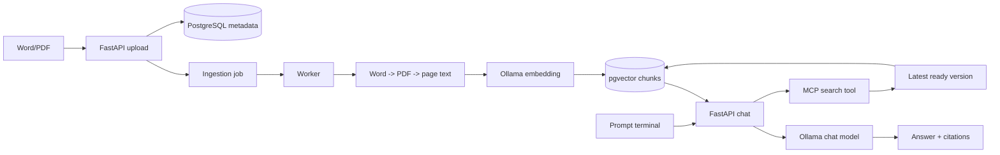

# Demo RAG: Ingest tài liệu và hỏi đáp từ PostgreSQL

Tài liệu này giải thích demo ở mức có thể trình bày với người không trực tiếp viết code. Demo cho thấy một file chính sách được đưa vào hệ thống, lưu thành nhiều phiên bản, tách thành các trang/chunk có vector trong PostgreSQL, rồi được truy xuất khi người dùng đặt câu hỏi ở terminal.

## Demo giải quyết vấn đề gì?

Thay vì đưa toàn bộ file vào model trong mỗi câu hỏi, hệ thống chuẩn bị dữ liệu một lần khi upload. Khi người dùng hỏi, hệ thống chỉ lấy những đoạn liên quan nhất từ database rồi đưa các đoạn đó cho model trả lời.

Điều này giúp:

- câu trả lời có thể truy ngược về file, version và trang;
- dữ liệu nằm trong database của doanh nghiệp thay vì phụ thuộc vào một vector database riêng;
- có thể lưu nhiều phiên bản của cùng một chính sách;
- câu hỏi thông thường dùng bản mới nhất, còn câu hỏi so sánh có thể đối chiếu bản cũ với bản mới;
- dễ kiểm tra và xóa dữ liệu theo tài liệu/version.

## Flow tổng thể



## Flow ingest database

1. Người dùng upload `.doc`, `.docx` hoặc `.pdf`.
2. API kiểm tra đuôi file, kích thước và lưu file gốc theo UUID. Tên file do người dùng gửi không được dùng làm đường dẫn lưu trữ.
3. Hệ thống tạo hoặc tìm `document`, sau đó cấp version tăng dần: `v0.1`, `v0.2`, `v0.3`.
4. API tạo `ingestion_job` ở trạng thái `queued` và trả kết quả ngay; người dùng không phải chờ trong request upload.
5. Worker nhận job. Với Word, worker render sang PDF bằng LibreOffice để có pagination ổn định trong container; sau đó PyMuPDF đọc text theo từng trang.
6. Mỗi trang được chia thành chunk. Chunk không đi qua ranh giới trang nên citation vẫn trỏ đúng trang.
7. Worker gửi từng chunk tới `qwen3-embedding:0.6b` qua Ollama và nhận vector 1024 chiều.
8. Worker ghi pages và chunks trong transaction. Version chỉ chuyển sang `ready` sau khi mọi chunk đã lưu thành công.
9. Nếu lỗi, job được retry tối đa ba lần. Bản `ready` trước đó vẫn giữ nguyên và không bị thay thế bởi bản lỗi.

Các bảng chính:

| Bảng | Vai trò |
|---|---|
| `documents` | Một tài liệu logic, ví dụ `hr_policy` |
| `document_versions` | Tên file, version, checksum, ngày upload, trạng thái |
| `pages` | Text theo từng trang của một version |
| `chunks` | Đoạn text, vector embedding, FTS search vector |
| `ingestion_jobs` | Hàng đợi và trạng thái xử lý |
| `conversations`, `messages` | Lịch sử hỏi đáp và citation |

Vector được lưu ở `chunks` cùng `page_id` và version gián tiếp qua `pages`. Vì vậy hai version của một file có vector độc lập; ingest version mới không ghi đè vector của version cũ.

## Flow hỏi đáp và compare

### Hỏi thông thường

1. CLI gửi prompt tới `POST /chat`.
2. Nếu không truyền version, backend chọn version `ready` mới nhất của từng tài liệu theo `major`, `minor`, `uploaded_at`.
3. Model được phép đề xuất một tool search. Backend vẫn khóa `mode`, `version_ids` và `top_k` theo request người dùng, không để model tự mở rộng phạm vi.
4. MCP server thực thi search trên PostgreSQL:
   - vector search cho câu hỏi diễn đạt tự nhiên;
   - PostgreSQL full-text search cho mã chính sách và từ khóa chính xác;
   - hybrid search gộp hai thứ hạng bằng Reciprocal Rank Fusion.
5. Các chunk trả về được gửi vào lượt sinh câu trả lời tiếp theo của model.
6. Backend kiểm tra citation `[C123]` có tồn tại trong evidence vừa truy xuất hay không. Citation hợp lệ mới được lưu và trả về terminal.

### So sánh version

Người dùng chỉ cần chọn một version cũ. Backend tìm version `ready` mới nhất cùng tài liệu rồi đọc evidence của cả hai bản. Hai version cụ thể cũng có thể được truyền nếu cần cố định cặp so sánh.

Hai bản được lấy độc lập, sau đó model đối chiếu nội dung. Hệ thống không giả định số trang giữa hai bản giống nhau.

## Vì sao chọn các công nghệ này?

### PostgreSQL + pgvector

PostgreSQL lưu được metadata nghiệp vụ, trạng thái job, nội dung trang, lịch sử chat và vector trong cùng một hệ thống. pgvector cung cấp cosine similarity; PostgreSQL FTS cung cấp tìm kiếm từ khóa. Dùng chung một database giúp filter theo `document_id`, version và trạng thái ngay trước khi lấy top-k, giảm độ phức tạp vận hành so với thêm một vector database riêng cho demo.

### PostgreSQL full-text search và hybrid search

Vector search tốt với paraphrase nhưng có thể không ưu tiên mã ngắn như `HR-01`. FTS phù hợp với mã chính sách, tên điều khoản và con số. Hybrid search giữ cả hai ưu điểm. `unaccent` giúp truy vấn tiếng Việt không dấu vẫn tìm được text có dấu.

### Ollama

Ollama chạy local, có API HTTP đơn giản và sử dụng GPU Docker Desktop. Model chat và model embedding được tách riêng: chat model tạo câu trả lời, embedding model biến text thành vector. Model có thể đổi qua `.env` mà không phải sửa code API.

### Qwen chat model

Model Qwen được chọn vì chạy local, hỗ trợ tiếng Việt, tool calling và context đủ cho demo. Máy demo đang dùng model chat thấp hơn để giảm thời gian phản hồi và bộ nhớ; embedding model vẫn cần giữ ổn định giữa lúc ingest và search. Nếu đổi embedding model hoặc dimension, phải re-embed dữ liệu cũ.

### FastAPI

FastAPI phù hợp với Python, có OpenAPI/Swagger sẵn để demo API upload, job và chat. Nó hỗ trợ streaming SSE để terminal nhận trạng thái và token trong khi model đang sinh câu trả lời.

### MCP

MCP tách quyền truy xuất dữ liệu thành tools (`search_documents`, `compare_document_versions`, `list_document_versions`). Model không truy cập SQL trực tiếp; API kiểm tra tên tool, arguments, version scope và kết quả trước khi đưa lại cho model.

### Worker đơn với PostgreSQL queue

Demo chỉ cần một worker nên chưa thêm Redis hoặc Celery. Job nằm trong PostgreSQL, có trạng thái, số lần thử và session advisory lock để tránh hai worker xử lý cùng lúc. Kiến trúc này đủ cho demo local và vẫn có đường nâng cấp lên queue riêng khi tải tăng.

### LibreOffice và PyMuPDF

Word không có pagination hoàn toàn ổn định nếu chỉ đọc paragraph. Render Word sang PDF rồi đọc từng page giúp citation theo trang nhất quán trong môi trường Docker. PyMuPDF nhẹ và đọc text PDF nhanh. OCR tài liệu scan chưa nằm trong phạm vi demo.

## Dữ liệu demo

Seed tạo bốn file giả lập:

- `hr_policy_v0.1.docx`
- `hr_policy_v0.2.docx`
- `bonus_policy_v0.1.docx`
- `bonus_policy_v0.2.docx`

Mỗi file có 10 trang và mỗi trang một câu. Một vài giá trị được thay đổi giữa hai version để kiểm tra compare, ví dụ số ngày phép hoặc số tháng thưởng. Đây là dữ liệu giả lập, không phải chính sách thật.

## Cách chạy cho buổi demo

Đảm bảo Docker Desktop đang chạy Linux containers và stack đã khởi động:

```powershell
Copy-Item .env.example .env
docker compose up -d --build
docker compose exec ollama ollama pull qwen3-embedding:0.6b
```

Ingest và kiểm tra database:

```powershell
docker compose exec app python -m scripts.demo_ingest --seed
```

Kết quả mong đợi: hai document, bốn version, 40 pages và 40 chunks; mỗi chunk có vector dimension 1024.

Chạy chat terminal:

```powershell
docker compose exec app python -m scripts.chat_cli
```

Thử các prompt:

```text
Theo HR-01, nhân viên được nghỉ phép bao nhiêu ngày mỗi năm?
Mức thưởng loại A là bao nhiêu?
```

Để so sánh, lấy UUID của một version cũ từ output ingest rồi chạy:

```powershell
docker compose exec app python -m scripts.chat_cli --version-id <OLD_VERSION_UUID> --compare
```

Sau đó nhập:

```text
HR-01 thay đổi thế nào giữa hai version?
```

Terminal hiển thị câu trả lời, thời gian xử lý và nguồn dạng `[C<chunk_id>] filename · page N`.

## Điểm cần nhấn mạnh khi trình bày

- Database là nơi lưu cả metadata nghiệp vụ và vector, nên có thể kiểm soát version và nguồn rõ ràng.
- Version mới không xóa version cũ; compare được thực hiện lúc user hỏi.
- Search mặc định chỉ dùng bản mới nhất đã xử lý thành công.
- Câu trả lời không có citation hợp lệ sẽ bị thay bằng thông báo thiếu bằng chứng.
- Model không được tự chạy SQL; mọi truy xuất đi qua tool có giới hạn.
- Demo ưu tiên tính dễ quan sát và kiểm chứng. Authentication, phân quyền theo user/tenant, OCR và worker pool chưa nằm trong phạm vi này.

## Giới hạn và hướng mở rộng

Demo giới hạn file 20 MiB, 200 trang và evidence compare 6500 ký tự. Worker hiện chạy một instance; production nên bổ sung authentication, object storage, queue riêng, retry/lease heartbeat, metrics, audit log và phân quyền theo tài liệu.

Khi dữ liệu lớn, có thể thêm HNSW index cho pgvector, tách worker thành pool và dùng reranker. Khi embedding model thay đổi, cần version hóa model/dimension và chạy migration/re-index có kiểm soát.

Chi tiết triển khai nằm trong [ARCHITECTURE.md](ARCHITECTURE.md), lệnh vận hành trong [RUNBOOK.md](RUNBOOK.md), và tiến độ trong [TASKS.md](TASKS.md).
