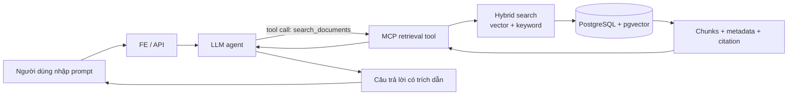
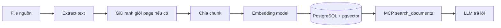
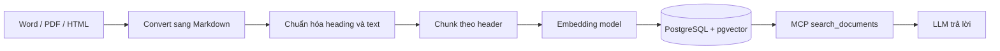
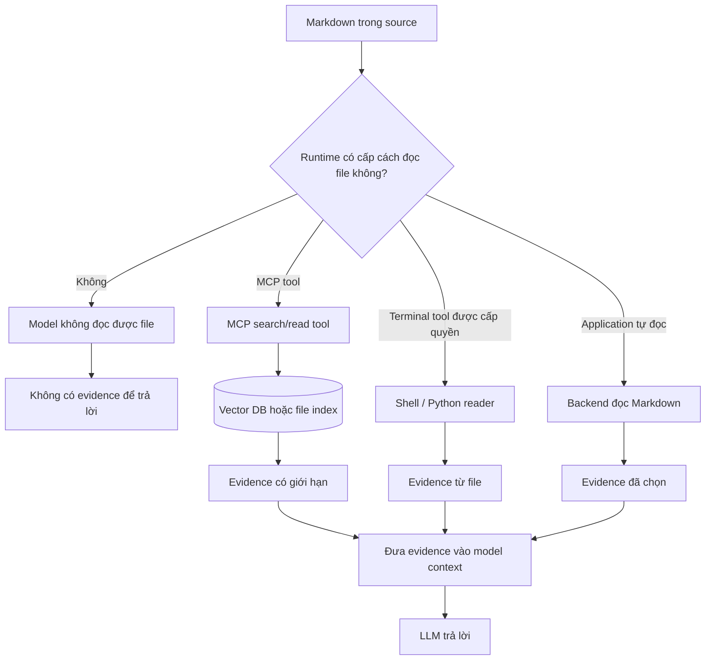

# Các flow dữ liệu RAG

Tài liệu này mô tả hai cách ingest dữ liệu và flow truy vấn dùng chung. Cả hai cách đều kết thúc ở cùng một vector database. Convert file sang Markdown chỉ là một bước bổ sung để giữ cấu trúc tài liệu và hỗ trợ chunk theo header tốt hơn; bước này không thay thế chunking, embedding hoặc retrieval.

## 1. Flow RAG chung

LLM không tự có quyền đọc filesystem, mở file local hoặc truy cập SQL database. Ứng dụng gọi MCP tool đã được giới hạn, lấy evidence từ PostgreSQL/pgvector rồi truyền evidence đó cho model.



LLM có thể quyết định cần tìm query nào, nhưng không thể tự đọc thư mục, tự mở Markdown hoặc tự chạy SQL. `search_documents` là boundary được kiểm soát giữa model và dữ liệu.

## 2. Flow chunk trực tiếp từ file

Đây là flow ngắn nhất cho text, Markdown hoặc text đã được extract trực tiếp từ PDF/Word.



Worker đọc file, tạo chunk, embed từng chunk và lưu text gốc, vector, page number và metadata. Khi user hỏi, model vẫn phải gọi MCP tool để lấy các chunk liên quan.

## 3. Flow convert file sang Markdown rồi mới chunk

Flow này thêm một bước convert trước khi chunk. Nó phù hợp khi format nguồn có cấu trúc cần giữ lại như heading, list hoặc section.



Markdown chỉ là representation trung gian. Nội dung sau khi convert vẫn phải được chunk, embed và insert vào vector database. Lợi ích là chunk có thể giữ section path như `Security > Blacklist`, giúp retrieval và citation rõ hơn.

## So sánh hai flow

| Bước | Chunk trực tiếp | Convert sang Markdown trước |
|---|---|---|
| Đọc file | Extract text | Extract text và chuyển đổi cấu trúc |
| Bước bổ sung | Không có | Convert và normalize Markdown |
| Chunking | Theo page hoặc số ký tự | Theo page hoặc header |
| Embedding | Bắt buộc | Bắt buộc |
| Vector DB | Bắt buộc | Bắt buộc |
| Query access | MCP tool | MCP tool |
| Phù hợp | Text đơn giản, layout ổn định | Tài liệu có heading/section rõ |

Flow convert là:

```text
file nguồn -> convert sang Markdown -> chunk -> embed -> vector DB -> MCP -> LLM
```

Flow trực tiếp là:

```text
file nguồn -> extract text -> chunk -> embed -> vector DB -> MCP -> LLM
```

Hai flow hội tụ ở cùng database và dùng cùng MCP contract. Đọc trực tiếp Markdown không có nghĩa là LLM được bypass MCP; file vẫn phải được index, và model vẫn chỉ nhận nội dung liên quan thông qua kết quả của tool.

## Xác nhận cách hiểu

Cách hiểu hiện tại là đúng:

- Convert sang Markdown **không bắt buộc** để xây RAG.
- Convert sang Markdown là một bước extra giúp chuẩn hóa cấu trúc và chunk theo header.
- Dù đi theo flow nào, dữ liệu vẫn cần chunk và embedding trước khi lưu vào vector DB.
- LLM không tự đọc file local hoặc đọc trực tiếp vector DB.
- LLM phải gọi MCP tool, ví dụ `search_documents`, để application lấy evidence rồi đưa evidence vào context của model.

## Model truy cập file như thế nào?

Sơ đồ dưới đây phân biệt model với runtime. Model chỉ nhìn thấy nội dung mà runtime đưa vào context. Nếu không có tool hoặc application đọc file, model không thể tự tìm Markdown trong source.



MCP không phải lựa chọn duy nhất về mặt kỹ thuật. Terminal tool hoặc backend tự đọc file cũng có thể cung cấp dữ liệu, nhưng terminal cần quyền filesystem và khó giới hạn phạm vi hơn. Trong flow RAG này, MCP/search tool là boundary được kiểm soát để model chỉ nhận evidence cần thiết.
